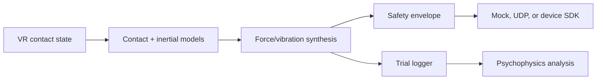

<p align="center">
  <strong>A reproducible workbench for substrate-free force cues, multimodal surgical contact, Unity integration, and perceptual-acuity experiments.</strong>
</p>

<p align="center">
  <a href="https://sarvenaz-m.github.io/haptisense-vr/"><strong>Launch interactive demonstrator</strong></a>
  · <a href="docs/GRANT_EVIDENCE_MATRIX.md">Grant evidence matrix</a>
  · <a href="docs/DEMO_SCRIPT.md">90-second reviewer tour</a>
  · <a href="docs/AKO_CASE_STUDY.md">AKO case study</a>
</p>

<p align="center">
  
  
  
  
  
</p>

## Why this repository exists

HaptiSense VR is an independent 2026 portfolio project by **Sarvenaz Mahmoudzadeh Khameneh**. It turns a research profile spanning intelligent healthcare, real-time software, sensor/device integration, EEG analysis, and human-centred prototyping into inspectable technical evidence.

The repository answers three concrete questions:

1. Can a body-grounded inertial cue approximate transient force feedback when no fixed substrate is available?
2. Can compliant force and cutaneous vibration be synthesized coherently for virtual surgical contact?
3. Can visual and haptic acuity be measured with a reproducible adaptive psychophysics workflow?

> [!IMPORTANT]
> Committed outputs are deterministic simulations and explicitly synthetic-observer data. They demonstrate implementation and research readiness—not participant, clinical, Phantom/Geomagic, or hardware-validation results.

## Reviewer quick path

| Time | What to inspect | What it demonstrates |
|---:|---|---|
| 30 s | [Interactive demonstrator](https://sarvenaz-m.github.io/haptisense-vr/) | Real-time control of tissue physics, force, vibration, and safety metrics |
| 60 s | [`force_models.py`](src/haptisense/force_models.py) + [`cues.py`](src/haptisense/cues.py) | Physics-based interaction and multimodal cue design |
| 30 s | [`unity/`](unity/) + [`bridge.py`](src/haptisense/bridge.py) | C#/Python and hardware–software integration path |
| 45 s | [`psychophysics.py`](src/haptisense/psychophysics.py) + [protocol](docs/EXPERIMENT_PROTOCOL.md) | Adaptive 2AFC design, logging, thresholds, and ethics readiness |
| 30 s | [`tests/`](tests/) + CI | Reproducibility and software quality |

## Live research workbench

The zero-dependency browser demonstrator exposes three tissue presets and four experimental controls:

- stiffness and damping;
- surface roughness;
- tool scan speed;
- soft, fibrous, and membrane tissue scenarios.

It recomputes compliant contact, friction, filtered inertial reaction, vibration frequency/amplitude, and safety interventions. It also visualizes the synthetic 2AFC staircase. Enable GitHub Pages with **Settings → Pages → GitHub Actions** to publish it.

[](https://sarvenaz-m.github.io/haptisense-vr/)

## Implemented evidence

| Research capability | Implementation | Inspect |
|---|---|---|
| Substrate-free force cues | Filtered body-grounded apparent reaction from controller acceleration | `BodyGroundedInertialCue` |
| Physics-based contact | Kelvin–Voigt normal contact and regularized Coulomb friction | `KelvinVoigtSurface` |
| Surgical multimodality | Force-dependent amplitude and scan-speed-dependent texture frequency | `MultimodalCueSynthesizer` |
| Safety engineering | Force, slew-rate, vibration amplitude, and frequency limits | `SafetyEnvelope` |
| Device integration | Protocol, mock device, and loopback UDP transport | `hardware.py` |
| Unity path | C# contact publisher, command receiver, and Python server | `unity/`, `bridge.py` |
| Psychophysics | 2AFC two-down/one-up staircase and reversal threshold | `psychophysics.py` |
| Research reproducibility | Fixed seeds, structured outputs, 13 tests, CI, and demo site | `results/`, `tests/`, `.github/` |

## Quick start

The scientific core uses only Python's standard library. Unity is not required.

```bash
python3 -m venv .venv
source .venv/bin/activate          # Windows: .venv\Scripts\activate
python3 -m pip install -e .

haptisense demo --output results/demo
haptisense psychophysics --output results/psychophysics
python3 -m unittest discover -s tests -v
```

Expected validation:

```text
Ran 13 tests
OK
```

## System architecture



All scientific calculations use SI units. Models are separated from game-engine and hardware transports so that a supported Phantom/Geomagic, wearable actuator, or custom embedded controller can be added without rewriting the research logic. See the [technical architecture](docs/ARCHITECTURE.md).

## Reproducible outputs

The default surgical-contact scenario runs for four seconds at 500 Hz and produces 2,000 time points.

| Output | Contents |
|---|---|
| `results/demo/haptic_trace.csv` | penetration, contact/inertial/safe force, amplitude, frequency, contact strength |
| `results/demo/metrics.json` | peak/RMS force, vibration metric, safety events, provenance warning |
| `results/demo/haptic_profile.svg` | reviewer-friendly force/vibration trace |
| `results/psychophysics/trials.csv` | 144 explicitly synthetic visual/haptic 2AFC records |
| `results/psychophysics/summary.json` | reversal counts, accuracy, and threshold estimates |
| `results/comparison/` | three-scenario comparison generated for v0.2 |

## Unity integration

The C# layer is deliberately small and inspectable:

1. `HapticContactPublisher` extracts contact state from the virtual tool.
2. `UnityBridgeServer` calculates contact, inertial, and texture cues in Python.
3. `SafetyEnvelope` limits the command.
4. `HapticCommandReceiver` exposes the latest safe cue to a future device adapter.

Start the loopback bridge with:

```bash
haptisense bridge
```

Unity's physics loop is not presented as a hard-real-time device servo. Proprietary drivers are not bundled, and device calibration remains a laboratory validation step.

## Psychophysics protocol

The pipeline independently exercises visual and haptic discrimination with a two-down/one-up 2AFC staircase. The formal protocol adds hypotheses, counterbalancing, calibration metadata, exclusion rules, safety stopping, ethics requirements, and a preregistered analysis path.

Read [`docs/EXPERIMENT_PROTOCOL.md`](docs/EXPERIMENT_PROTOCOL.md).

## Grant relevance

The codebase provides direct supplementary evidence for VR/haptics development, physics-based interaction, Unity/C#, psychophysical study design, and hardware–software integration. It does **not** affect academic grades and does not replace authentic evidence of prior work.

The line-by-line mapping between selection factors, files, defensible claims, and remaining validation is in [`docs/GRANT_EVIDENCE_MATRIX.md`](docs/GRANT_EVIDENCE_MATRIX.md).

## AKO continuity and evidence boundary

Earlier work at **AKO Smart Technologies Group** involved smart-healthcare concepts, non-invasive monitoring, wearable sensing, and electronics–software collaboration. This repository translates that systems perspective into a modern, reproducible haptics demonstrator.

It is a **current reconstruction and extension**, not a backdated AKO repository. Historical AKO work should be supported independently by authentic screenshots, reports, device photographs, code history, named collaborators, or references. See [`docs/AKO_CASE_STUDY.md`](docs/AKO_CASE_STUDY.md).

## What is not claimed

- no completed Phantom/Geomagic calibration;
- no measured 1 kHz hardware servo performance;
- no clinical validation;
- no recruited participants or human-subject results;
- no claim that this repository existed at AKO;
- no affiliation with or endorsement by INESC-ID or HIITS.

These limits are deliberate: credible scoping makes the implemented evidence stronger.

## Repository map

```text
src/haptisense/       Scientific models, safety, device API, CLI, Unity bridge
unity/                Inspectable C# integration example
tests/                Thirteen standard-library unit tests
docs/index.html       Zero-dependency interactive GitHub Pages demonstrator
docs/                 Protocol, architecture, grant matrix, and AKO case study
results/              Committed, explicitly synthetic reproducible outputs
.github/workflows/    Python CI and GitHub Pages deployment
```

## License and citation

Released under the [MIT License](LICENSE). Citation metadata are in [`CITATION.cff`](CITATION.cff).
