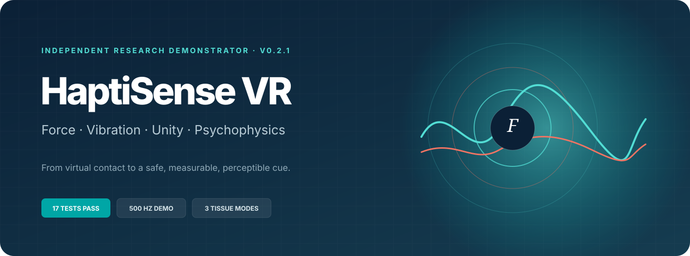
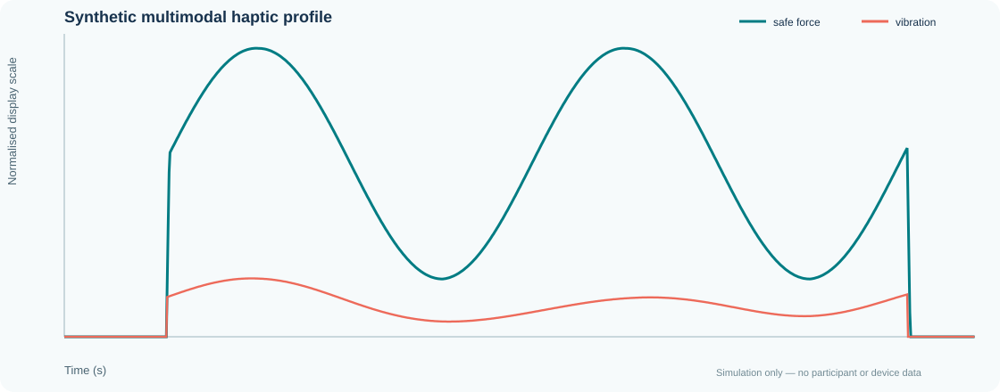
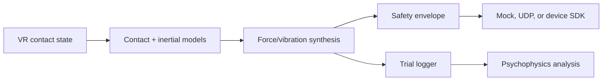

<p align="center">
  <strong>A reproducible workbench for body-grounded force cues, multimodal surgical contact, Unity integration, and perceptual-acuity experiments.</strong>
</p>

<p align="center">
  <a href="https://sarvenaz-m.github.io/haptisense-vr/"><strong>Launch interactive demonstrator</strong></a>
  · <a href="docs/RESEARCH_EVIDENCE_MATRIX.md">Research evidence matrix</a>
  · <a href="docs/DEMO_SCRIPT.md">90-second reviewer tour</a>
  · <a href="docs/BACKGROUND_AND_SCOPE.md">Background and scope</a>
</p>

<p align="center">
  <a href="https://github.com/sarvenaz-m/haptisense-vr/actions/workflows/ci.yml"></a>
  <a href="https://github.com/sarvenaz-m/haptisense-vr/actions/workflows/pages.yml"></a>
  
  
  
  
</p>

## v0.3 · Contact mechanics studio

A new computational workspace adds an orbitable contact surface, viscoelastic
relaxation, controlled model comparison, force/penetration loops and complete
session export/re-import. All graphics are generated locally; there are no
external frontend dependencies.

- **Inspect mechanics:** nonlinear elasticity, approach-damped Kelvin contact,
  and a Maxwell memory branch with an exact constant-input step update.
- **Compare fairly:** the same trajectory and shared parameters across models.
- **Reproduce:** JSON/CSV traces, bounded configuration, immutable CLI outputs,
  and per-sample Python/JavaScript parity across six experiments.
- **Review integration:** a generated Unity desktop replay scene, existing UDP
  sources and a guarded optional bench interface.
- **Evaluate evidence:** analytic checks, held-out synthetic identification,
  browser workflow tests and explicit validation limits.

Start locally with `python -m http.server 8000 --directory docs`, then open
`http://localhost:8000/workbench.html`. GitHub Pages publishes this route when
the v0.3 changes are merged into `main`.

[Methods and equations](docs/RESEARCH_METHODS.md) ·
[Five-minute reviewer tour](docs/REVIEWER_TOUR.md) ·
[Validation record](docs/VALIDATION_V03.md) · [Provenance](PROVENANCE.md)

## Overview

HaptiSense VR is an independent 2026 portfolio research prototype by
**Sarvenaz Mahmoudzadeh Khameneh**. It turns three haptics questions into
inspectable models, tests, structured outputs, and an interactive workbench:

1. Can transient body-grounded inertial cues approximate force feedback when
   no fixed substrate is available?
2. Can compliant force and cutaneous vibration be synthesised coherently for
   virtual surgical contact?
3. Can visual and haptic acuity be measured with a reproducible adaptive
   psychophysics workflow?

> [!IMPORTANT]
> Committed outputs are deterministic simulations and explicitly
> synthetic-observer data. They demonstrate implementation and research
> readiness—not participant, clinical, Phantom/Geomagic, or hardware
> validation.

## Reviewer quick path

| Time | What to inspect | What it demonstrates |
|---:|---|---|
| 30 s | [Interactive demonstrator](https://sarvenaz-m.github.io/haptisense-vr/) | Browser reproduction on a 500-sample/s model grid |
| 60 s | [`force_models.py`](src/haptisense/force_models.py) + [`cues.py`](src/haptisense/cues.py) | Physics-based interaction and multimodal cue design |
| 30 s | [`unity/`](unity/) + [`bridge.py`](src/haptisense/bridge.py) | C#/Python communication and a future device-integration path |
| 45 s | [`psychophysics.py`](src/haptisense/psychophysics.py) + [protocol](docs/EXPERIMENT_PROTOCOL.md) | Adaptive 2AFC design, logging, thresholds, and ethics readiness |
| 30 s | [`tests/`](tests/) + CI | Model correctness, web/Python parity, documentation links, and reproducibility |

## Live research workbench

The zero-dependency browser demonstrator exposes soft-tissue, fibrous-tissue,
and smooth-membrane presets together with stiffness, damping, roughness, and
scan-speed controls. Its vector contact, inertial, synthesis, and safety logic
matches the Python implementation on a 2 ms model grid; an automated parity test protects
the default metrics against drift.

The staircase chart is drawn from the same committed synthetic trial records as
`results/psychophysics/trials.csv`. The site is deployed automatically from
`docs/` by the GitHub Pages workflow.

[](https://sarvenaz-m.github.io/haptisense-vr/)

## Implemented evidence

| Research capability | Implementation | Inspect |
|---|---|---|
| Body-grounded force-cue model | Filtered apparent reaction from controller acceleration | `BodyGroundedInertialCue` |
| Physics-based contact | Kelvin–Voigt normal contact and regularised Coulomb friction | `KelvinVoigtSurface` |
| Surgical multimodality | Force-dependent amplitude and scan-speed-dependent texture frequency | `MultimodalCueSynthesizer` |
| Safety engineering | Force, slew-rate, vibration-amplitude, and frequency limits | `SafetyEnvelope` |
| Device integration path | Protocol, mock device, and loopback UDP transport | `hardware.py` |
| Unity source integration | C# contact publisher, command receiver, and Python server | `unity/`, `bridge.py` |
| Psychophysics | 2AFC two-down/one-up staircase and reversal threshold | `psychophysics.py` |
| Reproducibility | Fixed seeds, structured outputs, analytical and cross-runtime tests, CI | `results/`, `tests/`, `.github/` |

## Quick start

The scientific core uses only Python's standard library. Unity is not required.

```bash
python3 -m venv .venv
source .venv/bin/activate          # Windows: .venv\Scripts\activate
python3 -m pip install -e .

haptisense demo --output results/demo
haptisense psychophysics --output results/psychophysics
haptisense compare --output results/comparison
python3 -m unittest discover -s tests -v
```

For v0.3, also run:

```bash
haptisense research --output results/my-contact-run --model sls --protocol hold
```

This output directory must be new. For executed test counts, environments,
screenshots and limitations, use the [validation record](docs/VALIDATION_V03.md).

## System architecture



All scientific calculations use SI units. Models are separated from the game
engine and hardware transports so a supported Phantom/Geomagic device,
wearable actuator, or custom embedded controller can be added without rewriting
the scientific core. See the [technical architecture](docs/ARCHITECTURE.md).

## Reproducible outputs

The default surgical-contact scenario covers four model seconds at 500 samples/s and
produces 2,000 samples.

| Output | Contents |
|---|---|
| `results/demo/haptic_trace.csv` | penetration, contact/inertial/safe force, amplitude, frequency, contact strength |
| `results/demo/metrics.json` | peak/RMS force, vibration metric, safety events, provenance warning |
| `results/demo/haptic_profile.svg` | reviewer-friendly force/vibration trace |
| `results/psychophysics/trials.csv` | 144 explicitly synthetic visual/haptic 2AFC records |
| `results/psychophysics/summary.json` | reversal counts, accuracy, and threshold estimates |
| `results/comparison/` | three-scenario deterministic comparison |

## Unity integration

The repository provides import-ready C# source, not a complete Unity project or
recorded scene:

1. `HapticContactPublisher` extracts contact state from the virtual tool.
2. `UnityBridgeServer` calculates contact, inertial, and texture cues in Python.
3. `SafetyEnvelope` limits the command.
4. `HapticCommandReceiver` exposes the latest safe cue to a future device adapter.

Start the loopback bridge with:

```bash
haptisense bridge
```

Unity's physics loop is not presented as a hard-real-time device servo.
Proprietary drivers are not bundled, and compilation inside a specific Unity
editor version plus device calibration remain explicit validation steps.

## Psychophysics protocol

The pipeline independently exercises visual and haptic discrimination with a
two-down/one-up 2AFC staircase. The formal protocol adds hypotheses,
counterbalancing, calibration metadata, exclusion rules, safety stopping,
ethics requirements, and a preregistered analysis path.

Read [`docs/EXPERIMENT_PROTOCOL.md`](docs/EXPERIMENT_PROTOCOL.md).

## Background and evidence boundary

Earlier AKO experience and academic EEG work are intentionally separated.
AKO is described only through relevant smart-healthcare concepts,
application/web development, electronics–software collaboration, and
wearable-sensing concepts. EEG analysis and research methods belong to the
academic background and are not presented as AKO work.

This new independent 2026 prototype is documented separately from all
historical work. See [background and project scope](docs/BACKGROUND_AND_SCOPE.md)
and the [research-task evidence matrix](docs/RESEARCH_EVIDENCE_MATRIX.md).

## Limitations

- no completed Phantom/Geomagic calibration;
- no measured 1 kHz hardware-servo performance;
- no clinical or tissue-phantom validation;
- no recruited participants or human-subject results;
- no claim that this repository existed at AKO;
- no affiliation with or endorsement by INESC-ID or HIITS;
- no complete Unity project or verified editor build in this repository.

## Repository map

```text
src/haptisense/       Scientific models, safety, device API, CLI, Unity bridge
unity/                Import-ready C# integration source and setup instructions
tests/                Seventeen standard-library tests, including web parity
docs/index.html       Zero-dependency interactive GitHub Pages demonstrator
docs/                 Protocol, architecture, scope, and evidence documentation
results/              Committed, explicitly synthetic reproducible outputs
.github/workflows/    Python/JavaScript CI and GitHub Pages deployment
```

## License and citation

Released under the [MIT License](LICENSE). Citation metadata are in
[`CITATION.cff`](CITATION.cff).
