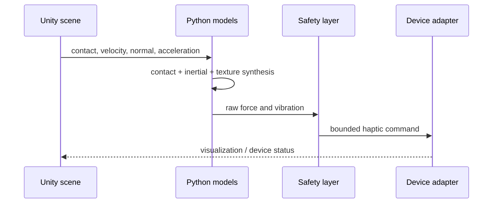

# Technical architecture

## Design principles

- **Model/transport separation:** scientific logic does not import Unity or a device SDK.
- **Safety after synthesis:** every command passes through one stateful limit layer.
- **Explicit units:** all core calculations use SI units.
- **Reproducibility:** simulations and synthetic observers are deterministic with fixed parameters/seeds.
- **Cross-runtime parity:** automated tests compare the 500 Hz browser model with the Python reference scenarios.
- **Honest evidence:** generated outputs identify themselves as synthetic.

## Data flow

## Mathematical model

For positive penetration \(x\), the normal force is:

\[
F_n = \max(0, kx + c\,v_{in})
\]

where \(k\) is stiffness, \(c\) is damping, and \(v_{in}\) is the velocity
component into the surface. Tangential force uses regularized Coulomb friction:

\[
\mathbf{F}_t = -\mu F_n\,r(v_t)\,\hat{\mathbf{v}}_t
\]

with \(r(v_t)\) increasing linearly near zero speed to avoid a command
discontinuity.

The substrate-free inertial approximation is:

\[
\mathbf{F}_{i} = \mathrm{LPF}(-m_{eff}\mathbf{a})
\]

where \(m_{eff}\) is an effective moving mass and the low-pass filter reduces
acceleration noise. It is a control hypothesis for later calibration, not a
claim that arbitrary sustained force can be produced without an anchor.

Vibration frequency is derived from tangential scan speed \(v_t\) and spatial
texture frequency \(f_s\):

\[
f_v = \mathrm{clip}(v_t f_s, f_{min}, f_{max})
\]

Amplitude combines roughness, normalized contact load, and speed.

## Timing

The Python and browser demos both default to 500 Hz and use equivalent vector
contact, inertial, synthesis, and safety calculations. The browser staircase is
drawn from the committed synthetic trial records rather than regenerated with a
second random-number implementation.

A real haptic device may require a higher device-specific servo rate (often
near 1 kHz). The 500 Hz value in this repository is a simulation sample rate,
not measured hardware throughput. The Unity bridge is supervisory and is not
presented as a hard-real-time servo implementation.

## Extension points

- implement the `HapticDevice` protocol for a supported SDK;
- feed measured force back into the logger;
- replace UDP with shared memory or the device vendor's recommended transport;
- add multi-contact geometry and anisotropic texture;
- fit tissue parameters from bench measurements;
- add a preregistered human-study configuration and pseudonymized database.
